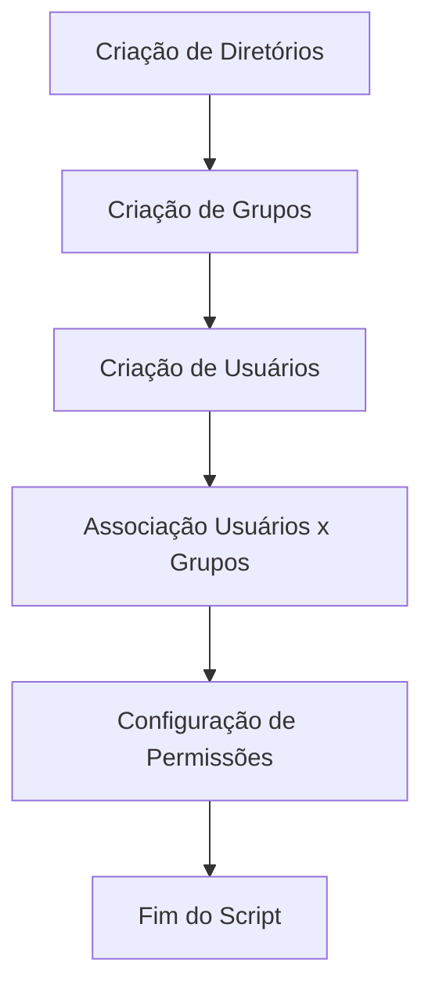

# 📜 Infraestrutura de Usuários, Grupos e Permissões

Este projeto contém um **script Bash** que cria automaticamente toda a infraestrutura de **diretórios**, **grupos de usuários**, **usuários** e define as **permissões necessárias** para um ambiente Linux organizado e seguro.

---

## 🛠️ O que o script faz

1. **Cria diretórios**:
   ```
   /publico
   /adm
   /ven
   /sec
   ```

2. **Cria grupos de usuários**:
   ```
   GRP_ADM
   GRP_VEN
   GRP_SEC
   ```

3. **Cria usuários e adiciona aos grupos**:

| Usuário    | Grupo    |
|------------|----------|
| carlos     | GRP_ADM  |
| maria      | GRP_ADM  |
| joao       | GRP_ADM  |
| debora     | GRP_VEN  |
| sebastiana | GRP_VEN  |
| roberto    | GRP_VEN  |
| josefina   | GRP_SEC  |
| amanda     | GRP_SEC  |
| rogerio    | GRP_SEC  |

4. **Define permissões dos diretórios**:

| Diretório  | Dono  | Grupo    | Permissão |
|------------|-------|----------|-----------|
| /adm       | root  | GRP_ADM  | 770       |
| /ven       | root  | GRP_VEN  | 770       |
| /sec       | root  | GRP_SEC  | 770       |
| /publico   | root  | root     | 777       |

---

## 🧩 Fluxo Gráfico



*Obs.: O gráfico acima mostra a sequência lógica de execução.*

---

## 🚀 Como executar

1. Clone o repositório:
   ```bash
   git clone https://github.com/seu-usuario/seu-repositorio.git
   ```

2. Dê permissão de execução para o script:
   ```bash
   chmod +x infraestrutura.sh
   ```

3. Execute como root (ou com sudo):
   ```bash
   sudo ./infraestrutura.sh
   ```

---

## ⚡ Observações importantes

- A senha dos usuários é criada como `Senha123` (criptografada).
- O script deve ser executado **com permissões administrativas**.
- Ideal para **ambientes de testes** ou **laboratórios**.
- **Não recomendado usar senhas fixas** em produção (ajustar para práticas seguras).

---

# 📚 Licença

Este projeto está sob a licença [MIT](LICENSE).

